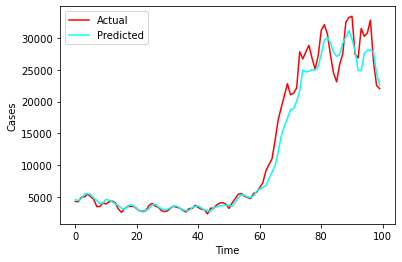
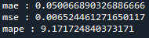

# :mask: COVID 19 New Cases Prediction

Prediction on number of new cases for COVID-19 based on the 30 days cases.

## Description

A time series data science project using LSTM deep learning models to achieved Mean absolute percentage error (MAPE) below 10%.

## Getting Started

### Dependencies

* Matplotlib version 3.5*
* Numpy version 1.22*
* Pandas version 1.4*
* Python version 3.8*
* Scikit-learn version 1.0*
* Scipy version 1.7*
* Seaborn 0.11*
* TensorFlow version 2.3*
* TensorBoard 2.9*

### Datasets

* Datasets : [Ministry of Health Malaysia](https://github.com/MoH-Malaysia/covid19-public)

### Executing program

* Code can be clone and run directly using any IDE with the environment listed
* The script was divided into several categories such as:
  1. Data Loading
  2. Data Inspection & Visualization
  3. Data Cleaning
  4. Feature Selection
  5. Data Preprocessing
  6. Model Development
  7. Model Analysis

### Results

* Model Architecture 

* Trendline

* TensorBoard

* Evaluation Metrics:

Mean Absolute Error (MAE), Mean Squared Error (MSE), Mean Absolute Percentage Error (MAPE)

### Future Works

* Adding more features would be wonderfull for experimentation :thinking:

## Acknowledgments

I would like to express my gratitude to [Ministry of Health Malaysia](https://github.com/MoH-Malaysia) for creating a wonderful datasets for forecasting or prediction problem.

PEACE OUT :love_you_gesture:

